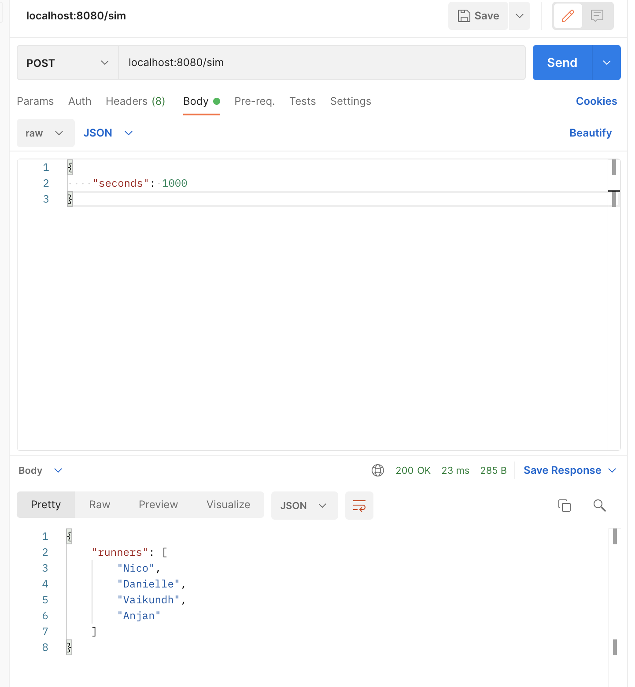
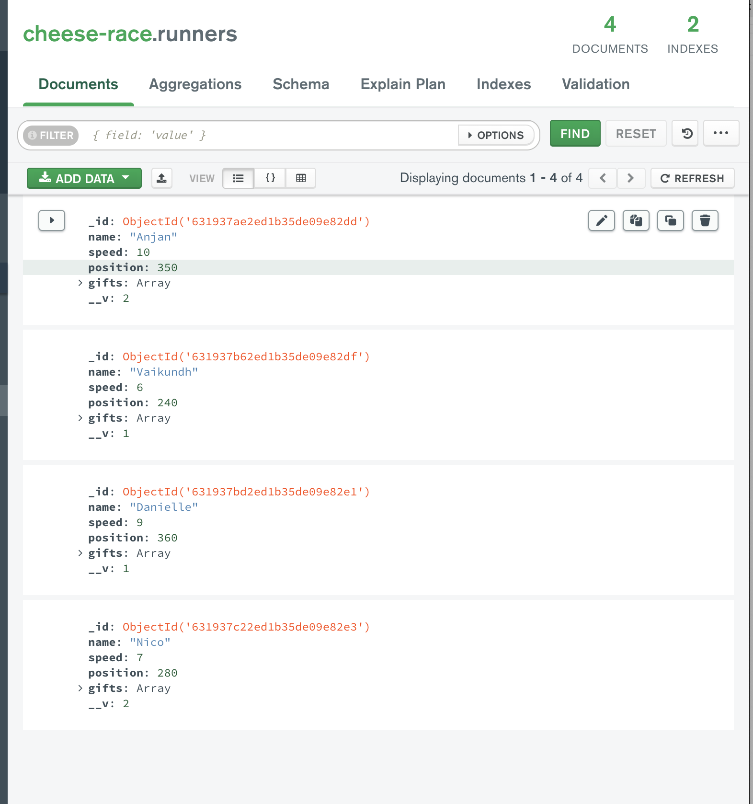

# Artem Tkachuk, Backend project for Web Development @ Berkeley

## A bit about design choices...
I went with TypeScript over JavaScript because I got used to it in my previous projects. I like to be always clear what I am operating on + better code completion in WebStorm.

I chose MongoDB since I am familiar with it, and it was also recommended.

I am using `mongoose` for the simplicity and readability of the queries.

I am using `dotenv` to store database URL, PORT, and gifts API URL for security reasons

## Data model
Quick summary of my models and interfaces:

There are two collections at play in my data model:
- `runners`
- `gifts`

Every runner has:
- name
- speed
- position
- array of gifts – we need this to keep track of the inventory for a particular runner, and e.g. preventing them from using gift that they don't have!

Every gift has:
- name
- boost
- gifted - # of times each gift was **gifted** (not used, as per spec). We need this for gift metadata
- in_a_row – # of times each gift was used in a row. Update it to 0 for every gift other than the current one whenever a new gift is used. Also check that 4 in a row does not happen

We don't need to store the name of the spectator, because we just want to keep track of the gifts, not who gave them.

I decided to separate `gifts` and `runners` tables because we have things about gifts that we want to keep track of globally across the project. Every other design decision about data model pretty much followed directly from demands of the business logic.

I decided to go with `in_a_row` data field for every gift, because it allows us to simply track the most recently used gifts.
 
## Harder routes

The hardest routes have definitely been `postSendGift()` and `postUseGift()`.

They were particularly hard because both required operating on two data models (runners and gifts), and checking that 4-in-a-row or first-letter rules are not violated.

Also, in general, both routes involved checking for a lot of conditions that could easily break the entire model, for example a runner can attempt to use a gift that they do not have! 

`postUseGift()`'s logic is the trickiest to implement of all, because we update a lot of data fields, counters, and doing at least one thing here wrong immediately messes up the whole data model, and it becomes unrecoverable.

I also did a lot of error handling, just because I had fun doing it.

## Status codes
I looked up the status code manual online, and I found that 404, 200, and 424 are the most suitable codes for the needs of this simple API:
- `200` for success
- `404` for a URL not found
- `424` for when our connection to database fails or when we violate any sort of conditions, like 4 gifts in a row.
- I could have included other error codes, but I don't think this is real 


## How to launch the app:

1. Install the packages: run `npm install` in the root directory of the project
2. Launch mongo. For Mac & Homebrew it is `brew services run  mongodb-community`
3. Launch external json gifts API: `json-server --watch db.json`
4. Launch server: `npm run prod`
5. Test API in Postman 
6. Monitor in MongoDB Compass

## How app launch is structured:
run server.ts –> create app() –> connect to mongo() –> get updated list of gifts() –> app launches on port


## Links
This is the tutorial I used to set up my core project and incorporate TypeScript:

https://medium.com/javascript-in-plain-english/typescript-with-node-and-express-js-why-when-and-how-eb6bc73edd5d

Since local database instance was enough as per project spec, install MongoDB locally:

https://zellwk.com/blog/install-mongodb/

We get additional security by using validation of mongoose models (such as specifying that the field is required):

https://stackoverflow.com/questions/41085281/how-to-retrieve-document-in-mongoose

For question about gift metadata:
https://dev.to/devtronic/javascript-map-an-array-of-objects-to-a-dictionary-3f42

Explanation of what Object.assign({}, {}) does: 
https://developer.mozilla.org/en-US/docs/Web/JavaScript/Reference/Global_Objects/Object/assign#merging_objects_with_same_properties

A guide i used for status codes:

https://www.restapitutorial.com/httpstatuscodes.html#:~:text=The%20424%20(Failed%20Dependency)%20status,action%20and%20that%20action%20failed.


# Documentation:

I found a nice template for the API documentation here:
https://github.com/jamescooke/restapidocs/blob/master/examples/login.md

--------------
## Register Runner

Used to register a new runner

**URL** : `/runner`

**Method** : `POST`

**Auth required** : NO

**Data constraints**

```json
{
    "name": "[non-empty string]",
    "speed": "[number]"
}
```

**Data example**

```json
{
  "name": "Anjan",
  "speed": 5
}
```

### Success Response

**Code** : `200 OK`

**Content example**

```json
{
  "code": 200,
  "Message": "Successfully inserted runner Anjan with speed 5" 
}
```

### Error Response

**Condition** : If could not connect to MongoDB or write a new runner there

**Code** : `424 FAILED DEPENDENCY`

**Content** :

```json
{
  "code": 424,
  "message": "Failed because could not update create runner in the database!"
}
```


--------------


## Get all runners

Used to get a list of all runners (any ordering)

**URL** : `/runner`

**Method** : `GET`

**Auth required** : NO


### Success Response

**Code** : `200 OK`

**Content example**

```json
{
  "runners": [
    "Nico",
    "Vaikundh",
    "Danielle",
    "Anjan"
  ]
}
```

### Error Response

**Condition** : If could not fetch the list of available runners

**Code** : `424 FAILED DEPENDENCY`

**Content** :

```json
{
  "code": 424,
  "message": "Failed because could not fetch the list of available runners!"
}
```


--------------


## Send a gift

Used to send a gift to a currently registered runner

**URL** : `/gift`

**Method** : `POST`

**Auth required** : NO

**Data constraints**

```json
{
    "name": "[non-empty string]",
    "spectator": "[non-empty string]",
    "runner": "[non-empty string. Runner must be registered]"
}
```

**Data example**

```json
{
  "name": "Mystery Pills",
  "spectator": "Emir",
  "runner": "Danielle"
}
```


### Success Response

**Code** : `200 OK`

**Content example**

```json
{
  "code": 200,
  "Message": "Successfully sent runner Danielle a gift called Mystery Pills"
}
```

### Error Response

**Condition** : If could not fetch the list of available gifts or write an update about the gift to the database

**Code** : `424 FAILED DEPENDENCY`

**Example Content** :

```json
{
  "code": 424,
  "message": "Failed because could not update list of runner's gifts in the database!"
}
```


--------------


## Use a gift

Used to use a gift to (hopefully) get a boost to speed for a current user

**URL** : `/use`

**Method** : `POST`

**Auth required** : NO

**Data constraints**

```json
{
    "runner": "[non-empty string. Runner must be registered]",
    "boost": "[non-empty string. Gift must exist in the API for gifts]"
}
```

**Data example**

```json
{
  "runner": "Anjan",
  "boost": "Bread"
}
```


### Success Response

**Code** : `200 OK`

**Content example**

```json
{
  "code": 200,
  "Message": "Runner Anjan successfully used a gift called Bread"
}
```

### Error Response

**Condition** : If the same gift is being used 4 times in a row OR if the current runner does not have the gift in their inventory

**Code** : `424 FAILED DEPENDENCY`

**Example Content** :

```json
{
  "code": 424,
  "message": "Failed because this gift does not exist for the current runner!"
}
```

--------------

## Simulate Race Time

Used to "play the game" some number of seconds (simulate): update positions of every player according to the time elapsed and their current speed (position = speed * time).

Output the **sorted** list of the runners in the race (who currently is 1st, 2nd, etc, in descending order)

**URL** : `/sim`

**Method** : `POST`

**Auth required** : NO

**Data constraints**

```json
{
    "seconds": "number > 0"
}
```

**Data example**

```json
{
  "seconds": 10
}
```


### Success Response

**Code** : `200 OK`

**Content example**

```json
{
  "runners": [
    "Danielle",
    "Vaikundh",
    "Nico",
    "Anjan"
  ]
}
```

### Error Response

**Condition** : If could not update positions of the runners or connect to database

**Code** : `424 FAILED DEPENDENCY`

**Example Content** :

```json
{
  "code": 424,
  "message": "Failed because could not update positions of the runners!"
}
```

----------

## Get gifts metadata

Used to get metadata for all the gifts (specifically, # times each gift was gifted)

**URL** : `/gift/metadata`

**Method** : `GET`

**Auth required** : NO


### Success Response

**Code** : `200 OK`

**Content example**

```json
{
  "gifts": {
    "Bread": 1,
    "Water": 3,
    "Mystery Pills": 0,
    "Cookie": 5,
    "Cheese Touch": 1
  }
}
```

### Error Response

**Condition** : If could not fetch the list of available gifts and their statistics

**Code** : `424 FAILED DEPENDENCY`

**Content** :

```json
{
  "code": 424,
  "message": "Failed because could not fetch the list of available gifts!"
}
```
------

# © Artem Tkachuk
### 07/09/2022
Club project to join industry branch for Web Development @ Berkeley